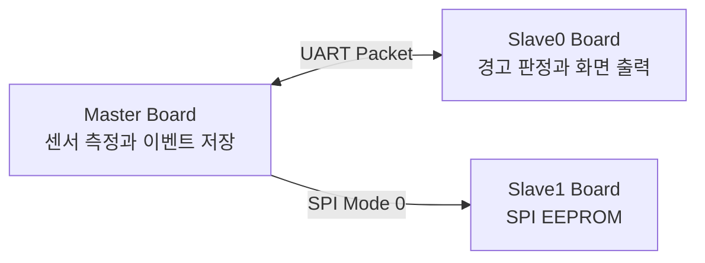

# GGH Engineering Portfolio

디지털 회로와 SoC를 설계하고 검증한 코드, FPGA에서 실행한 임베디드 펌웨어, On-Device AI 프로젝트를 한 저장소에서 관리합니다.

현재 저장소에는 RV32I Single-Cycle CPU, MicroBlaze 기반 AXI4-Lite 다중 보드 센서 모니터링 시스템, SPI 및 I2C 프로토콜 UVM 검증 프로젝트를 정리했습니다.

## 저장소 구성

| 구분 | 내용 |
| --- | --- |
| [프로젝트 설명](project-hub/) | 시스템 구성, 구현 내용, 검증 결과와 관련 코드 위치 |
| [하드웨어 설계](hardware-design/) | Verilog/SystemVerilog RTL, AXI4-Lite Custom IP, Block Design, Constraint |
| [검증](verification/) | SystemVerilog/UVM Testbench, Scoreboard, Functional Coverage |
| [임베디드](embedded/) | MicroBlaze C Firmware, HAL, Driver, Service, Application |
| [On-Device AI](ondevice-ai/) | Jetson과 TensorRT 기반 프로젝트 |

## 프로젝트

| 프로젝트 | 핵심 내용 | 코드 위치 |
| --- | --- | --- |
| RV32I Single-Cycle CPU | RV32I 명령어 Decode, Datapath, Memory와 프로그램 실행 | [프로젝트 설명](project-hub/rv32i-single-cycle-cpu.md) |
| AXI4-Lite 다중 보드 센서 모니터링 SoC | Custom IP, MicroBlaze Firmware, AXI GPIO UVM 검증 | [프로젝트 설명](project-hub/axi-sensor-monitoring-soc.md) |
| SPI 및 I2C 프로토콜 UVM 검증 | 직렬 통신 RTL, 양방향 Scoreboard, Functional Coverage | [프로젝트 설명](project-hub/spi-i2c-uvm.md) |

## RV32I Single-Cycle CPU

RV32I 기본 정수 명령어를 실행하는 Control Unit과 Datapath를 설계하고 Instruction Memory, CPU Core, Data Memory를 하나의 시스템으로 연결했습니다.

- R-Type, I-Type, Load, Store, Branch, Upper Immediate, Jump 명령어 구현
- Byte 주소 기반 Load와 Store, signed 및 unsigned Branch 처리
- Adder 프로그램 실행 결과 `sum = 55` 확인
- Bubble Sort 실행 결과 `{1, 3, 5, 7, 9}` 정렬 확인

아키텍처와 구현 명령어는 [RV32I Single-Cycle CPU 프로젝트 설명](project-hub/rv32i-single-cycle-cpu.md)에서 확인할 수 있습니다.

## AXI4-Lite 다중 보드 센서 모니터링 SoC

Master Board, Slave0 Board, Slave1 Board를 연결해 센서 측정부터 경고 판정, 화면 출력, EEPROM 이벤트 저장까지 수행하도록 구성했습니다.

### 구현 내용

- HC-SR04 거리와 DHT11 온습도 측정
- AXI4-Lite 기반 GPIO16, I2C, SPI, Timer, UART2 Custom Peripheral 구성
- UART Packet을 이용한 Master와 Slave0 간 센서 데이터 및 판정 결과 전송
- SPI EEPROM에 경고 이벤트를 5 Byte Record로 순환 저장
- MicroBlaze Firmware를 HAL, Driver, Service, Application 계층으로 구성
- AXI GPIO를 대상으로 UVM 검증 환경 구성

자세한 시스템 설명과 코드 위치는 [프로젝트 설명](project-hub/axi-sensor-monitoring-soc.md)에서 확인할 수 있습니다.

### 검증 결과

프로젝트 수행 당시 기록한 AXI GPIO UVM 검증 결과입니다.

| 항목 | 결과 |
| --- | ---: |
| Scoreboard Check | 3,821 |
| Pass | 3,821 |
| Fail | 0 |
| Functional Coverage | 100% |

## SPI 및 I2C 프로토콜 UVM 검증

SPI와 I2C 통신 RTL을 구현하고 프로토콜별 UVM 환경에서 송수신 데이터, 명령 조합, 경계값을 검증했습니다.

- SPI 8 bit MSB First, Full-Duplex, Mode 0와 다중 슬레이브 선택
- I2C 7 bit 주소, START, WRITE, READ, STOP, ACK/NACK 처리
- SPI와 I2C Functional Coverage 각각 100%
- Basys3 FPGA Logic Analyzer를 이용한 통신 신호 확인

구현 범위와 검증 시나리오는 [SPI 및 I2C 프로젝트 설명](project-hub/spi-i2c-uvm.md)에서 확인할 수 있습니다.

## 사용 기술

| 구분 | 기술 |
| --- | --- |
| Digital Design | Verilog, SystemVerilog, RISC-V RV32I, Single-Cycle CPU, FSM, AXI4-Lite, UART, SPI, I2C |
| FPGA | Basys3, Artix-7 XC7A35T, Vivado 2020.2, MicroBlaze |
| Verification | UVM 1.2, VCS, Verdi, Scoreboard, Functional Coverage |
| Embedded | C, Vitis 2020.2, MMIO, Interrupt |
| On-Device AI | Jetson, Computer Vision, TensorRT |

## 코드 관리 기준

- 설계 소스는 `rtl`, 제공되는 Testbench는 `tb` 폴더로 구분합니다.
- Vivado, Vitis, Simulator가 생성하는 Cache와 Build 파일은 저장하지 않습니다.
- 코드 로직과 기존 작성 스타일은 유지하고 필요한 부분에만 설명용 한국어 주석을 작성합니다.
- 프로젝트를 추가할 때 시스템 설명 문서와 관련 코드 경로를 함께 연결합니다.
