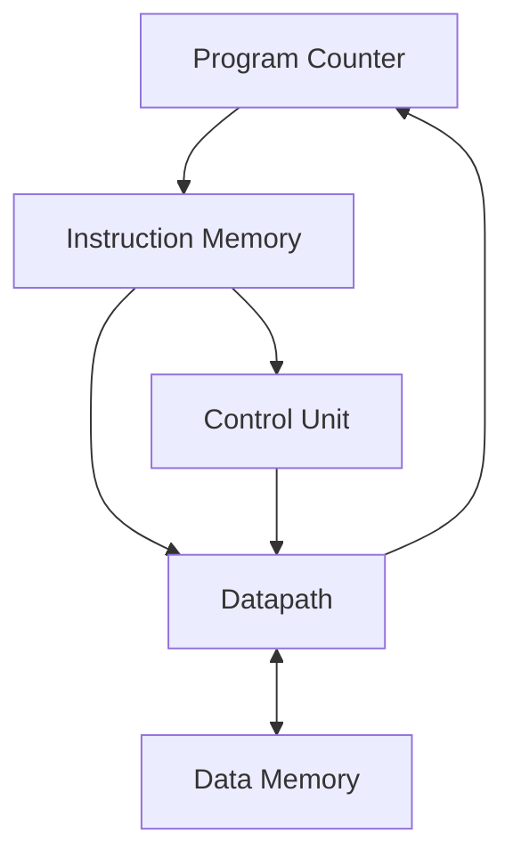

# RV32I Single-Cycle CPU

RV32I 기본 정수 명령어를 실행하는 32 bit Single-Cycle CPU를 SystemVerilog로 설계한 프로젝트입니다. 명령어 타입별 동작을 확인한 뒤 C 프로그램을 기계어로 변환해 Instruction Memory에 적재하고, 반복문과 함수 호출, 메모리 접근, 정렬 과정이 CPU 내부에서 실행되는 흐름을 검증했습니다.

## 한 사이클 안에서 이어지는 경로

Instruction Memory에서 가져온 32 bit 명령어를 Control Unit이 해석하고, Datapath가 Register File, Immediate Generator, ALU, Write Back 경로를 이용해 실행합니다. Load와 Store는 Data Memory를 거치며 Branch와 Jump 결과는 다음 Program Counter 선택에 반영됩니다.

## 설계 구성

| 구성 요소 | 역할 |
| --- | --- |
| `top_rv32i_soc` | Instruction Memory, CPU Core, Data Memory 연결 |
| `instruction_mem` | PC 기반 명령어 Fetch와 `.mem` 파일 적재 |
| `rv32i_cpu` | Control Unit과 Datapath 통합 |
| `rv32i_control_unit` | opcode와 funct 해석, 제어 신호 생성 |
| `rv32i_datapath` | Register File, ALU, Immediate, PC, Write Back 처리 |
| `data_mem` | Byte 주소 기반 LB, LH, LW, LBU, LHU, SB, SH, SW 처리 |

## 구현 명령어

| 분류 | 명령어 |
| --- | --- |
| Register 연산 | ADD, SUB, SLL, SLT, SLTU, XOR, SRL, SRA, OR, AND |
| Immediate 연산 | ADDI, SLTI, SLTIU, XORI, ORI, ANDI, SLLI, SRLI, SRAI |
| Load | LB, LH, LW, LBU, LHU |
| Store | SB, SH, SW |
| Branch | BEQ, BNE, BLT, BGE, BLTU, BGEU |
| Upper Immediate | LUI, AUIPC |
| Jump | JAL, JALR |

## 프로그램 실행 결과

명령어를 개별적으로 확인한 뒤 여러 명령어가 연결되는 프로그램 단위 실행을 Vivado 파형으로 확인했습니다.

| 프로그램 | 확인 내용 | 결과 |
| --- | --- | --- |
| Adder | 반복문, 함수 호출과 복귀, Stack Frame, Memory 저장 | `sum = 55`, `a = 0x12345678` |
| Bubble Sort | 배열 접근, 조건 분기, Swap 함수, 반복문 | `{3, 5, 9, 1, 7}`에서 `{1, 3, 5, 7, 9}`로 정렬 |

프로그램의 32 bit Machine Code는 `.mem` 파일에 저장했으며, `$readmemh`로 Instruction Memory에 적재해 실행했습니다.

## 코드 구성

| 파일 | 내용 |
| --- | --- |
| `rtl/top_rv32i_soc.sv` | 최상위 SoC 연결 |
| `rtl/rv32i_cpu.sv` | CPU Core 통합 |
| `rtl/rv32i_control_unit.sv` | 명령어 Decode와 제어 신호 |
| `rtl/rv32i_datapath.sv` | 데이터 처리 경로와 내부 구성 모듈 |
| `rtl/instruction_mem.sv` | Instruction ROM |
| `rtl/data_mem.sv` | Data RAM과 Load 및 Store 처리 |
| `rtl/define.vh` | opcode, ALU, Branch, Memory 제어값 |
| `rtl/instruction_code.mem` | Adder 프로그램 Machine Code |
| `rtl/instruction_mem_sort.mem` | Bubble Sort 프로그램 Machine Code |

## 개발 환경

| 구분 | 환경 |
| --- | --- |
| Language | SystemVerilog |
| ISA | RISC-V RV32I |
| Tool | Xilinx Vivado |
| Verification | Vivado Simulator, Waveform 분석 |
