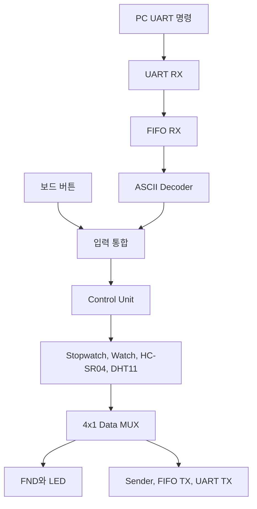

# UART-FIFO Sensor Monitoring and Time Control System

UART 통신으로 PC 명령을 수신하고 Stopwatch, Watch, HC-SR04, DHT11 기능을 선택적으로 제어하는 FPGA 통합 시스템입니다. 시간 및 센서 데이터는 FND와 LED에 표시하고, Sender와 UART TX를 통해 PC 터미널로 전송합니다.

## 시스템 구조



UART로 수신한 문자는 FIFO RX를 거쳐 버튼 선택 신호로 변환됩니다. Control Unit은 UART 명령과 물리 버튼을 동일한 제어 경로로 처리하며, 스위치로 선택한 기능의 Datapath를 동작시킵니다. 생성된 32 bit 데이터는 FND 표시 경로와 UART 송신 경로에서 함께 사용합니다.

## 동작 모드

| `sw[3:2]` | 모드 | 주요 동작 | 출력 데이터 |
| --- | --- | --- | --- |
| `2'b00` | Stopwatch | 실행, 정지, 초기화, 증가 및 감소 방향 전환 | 시, 분, 초, 1/100초 |
| `2'b01` | Watch | 현재 시간 표시, 설정 위치 선택, 값 증가 및 감소 | 시, 분, 초, 1/100초 |
| `2'b10` | HC-SR04 | Trigger 생성, Echo 시간 측정, 거리 계산 | 거리 |
| `2'b11` | DHT11 | 센서 요청, 40 bit 수신, Checksum 확인 | 습도와 온도 |

## UART 명령

ASCII Decoder는 대문자와 소문자를 동일하게 처리합니다.

| 명령 | 내부 제어 | 역할 |
| --- | --- | --- |
| D, d | Down | Watch 설정값 감소 또는 Stopwatch 방향 전환 |
| L, l | Left | Stopwatch 초기화 또는 Watch 설정 위치 이동 |
| M, m | Reset | 전체 시스템 Reset |
| R, r | Right | 실행 및 정지, 설정 위치 이동, 센서 측정 시작 |
| S, s | Status | 현재 모드의 데이터를 UART로 송신 |
| U, u | Up | Watch 설정값 증가 |

## 핵심 설계

### UART와 FIFO 입력 경로

100 MHz 시스템 클럭에서 9,600 bps UART 통신을 위한 16배 오버샘플링 Tick을 생성합니다. UART RX가 복원한 문자는 FIFO RX에 저장되며, ASCII Decoder가 데이터를 읽어 6 bit 버튼 선택 신호로 변환합니다.

### 통합 Control Unit

하나의 FSM에서 Stopwatch, Watch, HC-SR04, DHT11 모드와 세부 상태를 관리합니다. 선택된 모드에 따라 시간 카운터 제어 신호, Watch 편집 신호, 센서 시작 신호를 분리해 출력합니다.

### 센서 프로토콜 처리

HC-SR04 Datapath는 Trigger 신호를 만든 뒤 Echo High 시간을 측정해 거리를 계산합니다. DHT11 Datapath는 단일 DATA 선의 구동 방향을 전환하면서 40 bit 데이터를 수신하고 습도, 온도, Checksum으로 분리합니다.

### 표시 및 송신

4x1 MUX가 현재 모드의 32 bit 데이터를 선택합니다. FND Controller는 각 자릿수를 동적으로 표시하며, Sender는 모드 문자열과 데이터를 16개 ASCII 문자로 구성해 FIFO TX와 UART TX로 전달합니다.

## RTL 구성

| 파일 | 주요 모듈과 역할 |
| --- | --- |
| `rtl/TOP.v` | 전체 데이터 경로와 제어 경로 통합 |
| `rtl/MODE_CONTROL.v` | 모드 선택과 기능 제어 FSM |
| `rtl/modules.v` | Button Debounce, 4x1 MUX, ASCII Decoder, 거리 데이터 분리 |
| `rtl/uart_tx_rx_module.v` | UART TX, UART RX, Baud Tick 생성 |
| `rtl/fifo_module.v` | RX 및 TX FIFO 저장 공간과 포인터 제어 |
| `rtl/sender_module.v` | 모드 문자열과 측정 데이터를 ASCII로 변환 |
| `rtl/dht11_datapath.v` | 1 us Tick, DHT11 수신, HC-SR04 거리 측정 |
| `rtl/fnd_module.v` | 데이터 자릿수 분리와 FND 동적 표시 |
| `rtl/watch_datapath.v` | 시계 실행과 시간 설정 |
| `rtl/stopwatch_datapath.v` | Stopwatch 실행, 정지, 초기화, 증가 및 감소 |

## 통합 Testbench

`tb/tb_TOP.v`에서 PC UART 입력과 보드 버튼 입력을 함께 구동하고 센서 응답을 모델링합니다.

| 검증 대상 | 확인 내용 |
| --- | --- |
| UART 입력 경로 | 문자 Frame 수신, FIFO 저장, 버튼 선택 신호 변환 |
| Control Unit | 스위치 모드와 버튼 명령에 따른 제어 신호 생성 |
| Stopwatch | Run, Stop, Mode Change, Clear 시나리오 |
| Watch | 설정 모드 진입, 위치 이동, 값 증가 및 감소 |
| HC-SR04 | Trigger 출력, Echo 입력, 거리 데이터와 UART 송신 |
| DHT11 | 40 bit 응답, Checksum, 온습도 데이터와 UART 송신 |
| 출력 경로 | 4x1 MUX, FND, Sender, FIFO TX, UART TX 연결 |

프로젝트 수행 당시 Vivado Simulator의 파형을 통해 입력부, 제어부, 시간 처리부, 센서 처리부, 출력부의 End-to-End 연결을 확인했습니다.

## 코드 구성

```text
uart-fifo-sensor-time-controller/
├── README.md
├── rtl/
│   ├── TOP.v
│   ├── MODE_CONTROL.v
│   ├── modules.v
│   ├── uart_tx_rx_module.v
│   ├── fifo_module.v
│   ├── sender_module.v
│   ├── dht11_datapath.v
│   ├── fnd_module.v
│   ├── watch_datapath.v
│   └── stopwatch_datapath.v
└── tb/
    └── tb_TOP.v
```

## 개발 환경

| 구분 | 환경 |
| --- | --- |
| Language | Verilog HDL |
| FPGA Tool | Xilinx Vivado |
| Simulator | Vivado Simulator |
| System Clock | 100 MHz |
| UART | 9,600 bps, 8 bit, LSB First |
| Sensor | HC-SR04, DHT11 |
