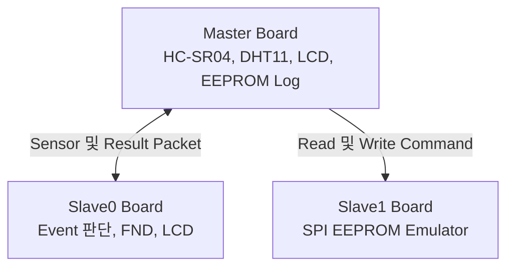

# AXI4-Lite 다중 보드 센서 모니터링 및 이벤트 로깅 SoC

MicroBlaze와 AXI4-Lite Custom Peripheral을 기반으로 센서 측정, 보드 간 통신, 경고 판정, 사용자 표시, EEPROM 이벤트 저장을 하나의 시스템으로 연결한 FPGA SoC 프로젝트입니다.

## 프로젝트 개요

| 항목 | 내용 |
| --- | --- |
| FPGA | Basys3, Artix-7 XC7A35T |
| Hardware | Verilog, SystemVerilog, Vivado 2020.2, MicroBlaze |
| Firmware | C, Vitis 2020.2 |
| Verification | UVM, Scoreboard, Functional Coverage |
| 통신 | AXI4-Lite, UART Packet, SPI Mode 0, I2C |

## 시스템 구성

### Master Board

- HC-SR04 거리와 DHT11 온습도 측정
- I2C LCD와 Serial Terminal 출력
- UART2를 이용한 Sensor Packet 송신과 Result Packet 수신
- Warning Event의 SPI EEPROM 저장 및 조회

### Slave0 Board

- Sensor Packet 수신과 XOR Checksum 확인
- 거리, 온도, 습도 조건 판정
- 동일 조건 3회 연속 확인 후 경고 확정
- Result Packet 회신과 FND, I2C LCD 출력

### Slave1 Board

- SPI Mode 0 EEPROM 동작
- 0x02 Write와 0x03 Read Command 처리
- FPGA 내부 256 Byte Memory 제공
- 단일 Byte 및 Sequential Read/Write 지원

## 코드 위치

| 구현 영역 | 경로 | 주요 내용 |
| --- | --- | --- |
| Hardware | [AXI Sensor Monitoring SoC](../hardware-design/axi-sensor-monitoring-soc/) | AXI Custom IP, Block Design, Constraints |
| Hardware | [SPI EEPROM Emulator](../hardware-design/spi-eeprom-emulator/) | SPI EEPROM RTL과 Directed TB |
| Verification | [AXI GPIO UVM](../verification/axi-gpio-uvm/) | DUT, UVM Components, Scoreboard, Coverage |
| Firmware | [MicroBlaze AXI System](../embedded/microblaze-axi-system/) | Master 및 Slave0 Firmware |

## AXI 주소 맵

| Peripheral | Master Base Address | 기능 |
| --- | --- | --- |
| AXI UART Lite | 0x4060_0000 | Serial Terminal |
| AXI INTC | 0x4120_0000 | Interrupt Control |
| DHT11 | 0x44A0_0000 | 온도와 습도 측정 |
| GPIO16 | 0x44A1_0000 | Button, LED, FND 제어 |
| HC-SR04 | 0x44A2_0000 | 거리 측정 |
| I2C | 0x44A3_0000 | LCD 제어 |
| SPI | 0x44A4_0000 | EEPROM 읽기와 쓰기 |
| Timer | 0x44A5_0000 | 2초 측정 주기 생성 |
| UART2 | 0x44A6_0000 | Master와 Slave0 Packet 통신 |

## 패킷 구성

### Sensor Packet

`AA | 10 | DIST_H | DIST_L | TEMP | HUMID | XOR`

### Result Packet

`AA | 20 | MINUTE | SECOND | RESULT_CODE | XOR`

고정 Header와 Packet Type을 기준으로 Frame을 구분하고 XOR Checksum으로 수신 데이터를 확인합니다.

## SPI EEPROM Emulator

| Command | 값 | 동작 |
| --- | ---: | --- |
| Write | 0x02 | 시작 주소 이후의 데이터를 순차 저장 |
| Read | 0x03 | 시작 주소 이후의 데이터를 MISO로 순차 출력 |

Warning Log는 EEPROM 0x10부터 0xFF 영역에 Sequence, Time, Warning Code, Checksum으로 구성된 5 Byte Record를 저장합니다. 최대 48개 Record를 유지하며 저장 범위의 끝에 도달하면 처음 위치부터 다시 기록합니다.

## 검증 결과

프로젝트 수행 당시 기록한 검증 결과입니다.

| 검증 항목 | 결과 |
| --- | ---: |
| AXI Read Transaction | 1,265 |
| AXI Write Transaction | 1,255 |
| GPIO I/O Comparison | 2,556 |
| Scoreboard Check | 3,821 |
| Pass | 3,821 |
| Fail | 0 |
| Functional Coverage | 100% |
