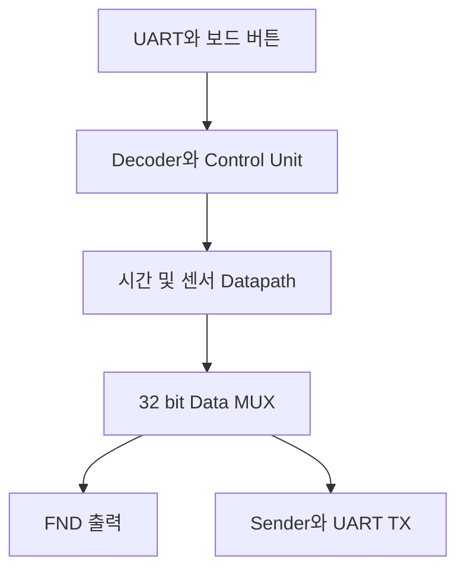

# UART-FIFO 기반 FPGA 센서 모니터링 및 시간 제어 시스템

PC UART 명령과 FPGA 보드 버튼으로 Stopwatch, Watch, HC-SR04, DHT11 기능을 제어하고, 처리 결과를 FND와 UART로 출력하는 통합 디지털 시스템입니다.

## 설계 목표

- UART 명령을 FPGA 내부 제어 신호로 변환
- FIFO를 이용해 통신부와 제어부의 데이터 처리 시점 분리
- 시간 계측과 두 센서 프로토콜을 독립적인 Datapath로 구현
- Control Unit에서 네 가지 동작 모드와 세부 상태 통합
- 시간 및 센서 데이터를 FND와 PC UART 터미널에 동시 출력

## 데이터 흐름

## 구현 범위

| 영역 | 구성 | 처리 내용 |
| --- | --- | --- |
| 입력부 | UART RX, FIFO RX, ASCII Decoder, Debouncer | PC 문자 명령과 물리 버튼 입력 통합 |
| 제어부 | Control Unit | Stopwatch, Watch, HC-SR04, DHT11 모드 제어 |
| 시간 처리부 | Stopwatch, Watch Datapath | 시간 계측, 실행 및 정지, 시간 설정 |
| 센서 처리부 | HC-SR04, DHT11 Datapath | 거리 측정, 40 bit 온습도 데이터 수신 |
| 출력부 | 4x1 MUX, FND Controller, Sender, FIFO TX, UART TX | 선택 데이터 표시와 PC 전송 |

## 통합 검증

- UART 문자 명령이 FIFO와 Decoder를 거쳐 제어 신호로 변환되는 흐름 확인
- Stopwatch 실행, 정지, 방향 전환, 초기화 시나리오 확인
- Watch 설정 위치 이동과 시간 증가 및 감소 확인
- HC-SR04 Trigger와 Echo 기반 거리 측정 흐름 확인
- DHT11 센서 응답과 40 bit 데이터 및 Checksum 처리 확인
- 선택된 데이터가 FND와 UART TX로 전달되는 End-to-End 경로 확인

## 코드 위치

| 영역 | 경로 |
| --- | --- |
| 프로젝트 README | [UART-FIFO Sensor Monitoring and Time Control System](../hardware-design/uart-fifo-sensor-time-controller/) |
| RTL | [rtl](../hardware-design/uart-fifo-sensor-time-controller/rtl/) |
| 통합 Testbench | [tb](../hardware-design/uart-fifo-sensor-time-controller/tb/) |
