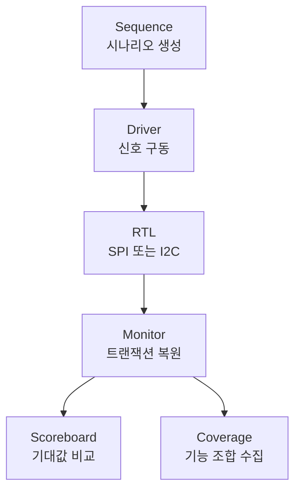

# SPI 및 I2C RTL과 UVM 검증

SPI와 I2C 통신을 SystemVerilog RTL로 구현하고, 프로토콜별 UVM 환경에서 송수신 데이터와 기능 커버리지를 확인한 프로젝트입니다. 시뮬레이션 검증과 Basys3 FPGA 신호 관찰까지 이어지는 흐름으로 구성했습니다.

## 설계 기준

| 프로토콜 | 구현 내용 |
| --- | --- |
| SPI | 8 bit, MSB First, Full-Duplex, Mode 0, 다중 슬레이브 선택 |
| I2C | 7 bit 주소 `7'h20`, 8 bit 데이터, START, WRITE, READ, STOP, ACK/NACK |
| 신호 처리 | SPI 입력 동기화와 에지 검출, I2C Open-Drain 방식의 SDA 제어 |

SPI RTL은 두 슬레이브의 선택과 양방향 데이터 전송을 다루며, I2C RTL은 Master와 Slave의 주소 판별, 데이터 이동, ACK 처리 과정을 상태 머신으로 구성했습니다.

## 검증 흐름

SPI와 I2C는 각각 독립된 Agent, Driver, Monitor, Scoreboard, Coverage를 사용합니다. Monitor가 복원한 트랜잭션을 Scoreboard와 Coverage에 동시에 전달해 데이터 정확성과 시나리오 도달 범위를 함께 확인합니다.

## 검증 시나리오

### SPI

| 시나리오 | 확인 내용 |
| --- | --- |
| Basic | Slave0과 Slave1의 기본 송수신 |
| Random | 슬레이브 선택과 송수신 데이터 랜덤 조합 |
| Corner | `00`, `FF`, `55`, `AA` 패턴 |
| Full | Basic, Random, Corner 연속 수행 |

### I2C

| 시나리오 | 확인 내용 |
| --- | --- |
| Write | Master 전송 데이터와 Slave 수신 데이터 비교 |
| Read | Slave 전송 데이터와 Master 수신 데이터 비교 |
| Multi Write | 한 트랜잭션 내 연속 데이터 전송 |
| Random | Write와 Read 데이터 랜덤 조합 |
| Boundary | `00`, `FF`를 포함한 경계 데이터 |

## 수행 기록

프로젝트 완료 보고서에 정리된 수행 결과입니다.

| 항목 | 결과 |
| --- | ---: |
| SPI Functional Coverage | 100% |
| I2C Functional Coverage | 100% |
| SPI Scoreboard | 양방향 데이터 비교 통과 |
| I2C Scoreboard | Write 및 Read 데이터 비교 통과 |
| FPGA 확인 | SPI 및 I2C Logic Analyzer 신호 확인 |

## 코드 구성

| 경로 | 내용 |
| --- | --- |
| `rtl/spi/slave0` | SPI Slave와 Counter, FND 제어 RTL |
| `rtl/spi/slave1` | SPI Slave와 FND ROM RTL |
| `rtl/i2c` | I2C Master, Slave, Loopback RTL |
| `tb/spi` | SPI UVM Testbench |
| `tb/i2c` | I2C UVM Testbench |

코드 흐름은 각 프로토콜의 `sequence`에서 시작해 `driver`, RTL, `monitor`, `scoreboard`, `coverage` 순서로 확인할 수 있습니다.

## 개발 환경

| 구분 | 환경 |
| --- | --- |
| Language | SystemVerilog |
| Verification | UVM 1.2, VCS, Verdi |
| FPGA | Basys3 |
| FPGA Tool | Vivado |
