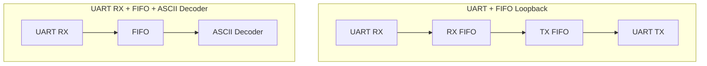

# UART, FIFO, ASCII Decoder SystemVerilog 검증

UART RX/TX, FIFO, ASCII Decoder의 개별 기능과 두 가지 통합 데이터 경로를 SystemVerilog class 기반 검증 환경에서 확인한 프로젝트입니다. 실제 UVM 라이브러리를 사용하지 않고 Transaction, Generator, Driver, Monitor, Scoreboard, Environment로 역할을 분리한 UVM Style 구조를 적용했습니다.

## 프로젝트 핵심

- UART 직렬 Frame의 송신 및 수신 데이터 복원 검증
- FIFO의 데이터 순서와 Full, Empty 경계 상태 검증
- ASCII 명령의 one-hot 제어 신호 변환 검증
- UART RX에서 UART TX까지 이어지는 Loopback 경로 검증
- UART RX에서 ASCII Decoder까지 이어지는 명령 처리 경로 검증
- Generator 기대값과 Monitor 수집값의 Scoreboard 자동 비교

## 검증 대상

| 구분 | 대상 | 확인 내용 |
| --- | --- | --- |
| 개별 검증 | UART RX | Start bit, 8 bit 데이터, Stop bit 수신과 `rx_done`, `rx_data` 확인 |
| 개별 검증 | UART TX | `tx_start` 이후 UART Frame 송신과 `tx_busy`, 직렬 데이터 복원 확인 |
| 개별 검증 | FIFO | Reset, 무작위 Push/Pop, 데이터 순서, Full/Empty 상태 확인 |
| 개별 검증 | ASCII Decoder | D/L/M/R/S/U 대소문자 변환과 정의되지 않은 입력의 기본값 확인 |
| 통합 검증 | UART + FIFO Loopback | RX 입력 데이터가 두 FIFO를 거쳐 TX로 재전송되는 경로 확인 |
| 통합 검증 | UART RX + FIFO + ASCII Decoder | UART 명령이 FIFO를 거쳐 `button_sel`로 변환되는 경로 확인 |

## 통합 데이터 경로



Loopback 경로에서는 UART RX로 복원한 8 bit 데이터를 RX FIFO와 TX FIFO를 통해 UART TX에 전달합니다. Decoder 경로에서는 수신 데이터를 FIFO에 저장한 뒤 Decoder 처리 시점에 맞춰 고정하고, ASCII 명령에 대응하는 `button_sel`을 출력합니다.

## UVM Style Testbench 구성

| 구성 요소 | 역할 |
| --- | --- |
| Transaction | 입력 데이터, DUT 출력, 기대값을 전달하는 단위 |
| Generator | 제약 조건을 적용한 무작위 데이터 생성 |
| Driver | Transaction을 DUT 입력 신호와 UART Frame으로 변환 |
| Interface | Testbench와 DUT 신호 연결 |
| Monitor | 완료 신호와 출력 Frame을 기준으로 DUT 결과 수집 |
| Scoreboard | Generator 기대값과 Monitor 실제값 비교 |
| Environment | Mailbox와 Event를 이용해 검증 구성 요소 연결 |

Generator가 생성한 Transaction은 Driver와 Scoreboard에 각각 전달됩니다. Driver는 DUT를 구동하고, Monitor는 출력 타이밍에 맞춰 결과를 수집합니다. Scoreboard는 두 경로에서 받은 값을 비교한 뒤 다음 Transaction 생성을 허용합니다.

## ASCII 명령 변환

| 입력 문자 | `button_sel` |
| --- | --- |
| D, d | `6'b000001` |
| L, l | `6'b000010` |
| M, m | `6'b000100` |
| R, r | `6'b001000` |
| S, s | `6'b010000` |
| U, u | `6'b100000` |
| 정의되지 않은 입력 | `6'b000000` |

## 수행 결과

프로젝트 수행 당시 Vivado Simulator와 Scoreboard 비교로 확인한 결과입니다.

| 검증 항목 | 결과 |
| --- | ---: |
| UART RX 데이터 복원 | Pass |
| UART TX Frame 송신 및 데이터 복원 | Pass |
| FIFO 데이터 순서와 상태 신호 | Pass |
| ASCII Decoder 명령 변환 | Pass |
| UART + FIFO Loopback 데이터 비교 | Pass |
| UART RX + FIFO + ASCII Decoder 출력 비교 | Pass |

## 코드 구성

```text
uart-fifo-ascii-sv/
├── rtl/
│   ├── unit/
│   │   ├── ascii_decoder.v
│   │   ├── baud_tick_gen.v
│   │   ├── fifo.v
│   │   ├── uart_rx.v
│   │   └── uart_tx.v
│   └── integration/
│       ├── TOP.v
│       ├── uart.v
│       ├── uart_fifo_decoder.v
│       └── uart_fifo_loopback.v
└── tb/
    ├── unit/
    │   ├── tb_ascii_decoder_sv.sv
    │   ├── tb_fifo_sv.sv
    │   ├── tb_uart_rx_sv.sv
    │   └── tb_uart_tx_sv.sv
    └── integration/
        ├── tb_uart_fifo_decooder_sv.sv
        └── tb_uart_fifo_loopback_sv.sv
```

각 Testbench는 동일한 class 이름을 독립적으로 정의하므로 시뮬레이션 Source Set을 검증 대상별로 분리해 실행합니다.

## 시뮬레이션 구성

| Simulation Top | 필요한 RTL |
| --- | --- |
| `tb_uart_rx_sv` | `baud_tick_gen.v`, `uart_rx.v` |
| `tb_uart_tx_sv` | `baud_tick_gen.v`, `uart_tx.v` |
| `tb_fifo_sv` | `fifo.v` |
| `tb_ascii_decoder_sv` | `ascii_decoder.v` |
| `tb_uart_fifo_loopback_sv` | Unit RTL 전체, `uart.v`, `uart_fifo_loopback.v`, `TOP.v` |
| `tb_uart_fifo_decooder_sv` | `baud_tick_gen.v`, `uart_rx.v`, `fifo.v`, `ascii_decoder.v`, `uart_fifo_decoder.v` |

## 개발 환경

| 구분 | 환경 |
| --- | --- |
| RTL | Verilog HDL |
| Testbench | SystemVerilog class 기반 UVM Style |
| FPGA Tool | Xilinx Vivado |
| Simulator | Vivado Simulator |
| 검증 방식 | Directed 조건, Constrained Random, Assertion, Scoreboard |

